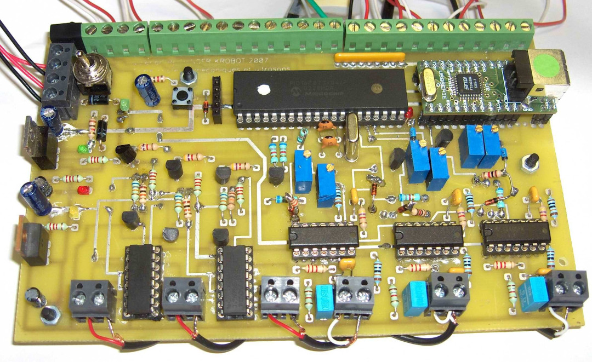

# Carte multi capteurs USB : Télémétrie ultrasonique & capteurs de contact (2007)

## Introduction

Comme tous les ans, le club de robotique de l’école, dénommé [K]robot,
conçoit et réalise un robot dans le but de participer à la coupe de France de
robotique qui à lieue à la Ferté Bernard durant le mois de mai.

Chaque année les règles de la compétition sont différentes, mais certaines
restent d’actualité au cours des ans. L’une d’elle oblige les équipes à munir
leur robot d’un système de détection du robot adverse pour éviter les
collisions.
Il faut donc munir le robot d’un tel système, et assurer sa fiabilité pour passer le
cap de l’homologation.

Valérian R. a choisi de concevoir et réaliser un tel système dans le cadre
d'un bureau d'étude.

Pour consulter ce bureau d'étude, vous pouvez demander le pdf à un membre du
Krobot.

