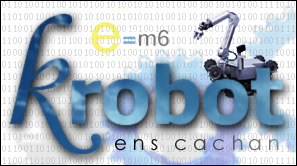

# La coupe de France de robotique 1999

## Résultats

Au total, avec 10 points, nous avons terminé en 54ème position
(non qualifiés pour les huitièmes de finale) sur les 78 équipes homologuées.

| Match | Equipes                   | Tours renversées | Résultats            | Points     | Classement     |
|-------|---------------------------|------------------|----------------------|------------|----------------|
| 1er   | Krobot  Mines de Paris | 1  0          | Victoire  Défaite | 8  0    | 26  30      |
| 2ème  | Krobot  ECAM           | 0  0          | Défaite  Défaite  | 0  0    | 35  35      |
| 3ème  | Krobot  Lancelot I     | 0  0          | Défaite  Défaite  | 0  0    | 48  44      |
| 4ème  | Krobot  Paris XI Orsay | 2  7          | Défaite  Victoire | 2  14   |  ?  ?       |
| 5ème  | Krobot  ENI St Etienne | 0  0          | Défaite  Défaite  | 0  0    | 54  ?       |

Homologation réussie le mercredi 12/05 vers 22h15.

## En direct Live de la Ferté-Bernard !

Nous sommes arrivés à la Ferté mercredi à 17h sous une pluie battante
(signe des dieux ?). Pour nous précipiter aussitôt dans un minuscule box dont
Kaptn a réussi à arracher le numéro à l'accueil débordé de l'ANSTJ, au péril de
sa vie. Puis nous avons déballé le matériel (toujours sous la pluie) et avons
tenté de tout bourrer dans les 4 m² du box que nous partageons avec le
robot-club de Torsac (robot des agrégatifs). Et hop le fer à souder, et hop le
multimètre, et hop l'oscillo, et hop le PC, et hop le robot ! Le robot ?
Merde ! Le robot ! On a oublié le robot ! Mais non, c'est une blague ! Notre
bien-aimé président l'a religieusement porté sur ses genoux pendant tout le
voyage...

Et les travaux recommencèrent...

###  La quête de l'homologation

Cette fois-ci, on est prêts ! On homologue le robot !

Allez zou ! Après avoir brillamment passé les tests de gabarit (à la lime et
à la scie), il a fallu aller chercher en courant l'action télécommandée oubliée
dans le stand, et signaler à l'aide d'un scotch rouge très seyant le bouton
d'arrêt d'urgence du robot. Puis vint le moment fatidique de l'essai sur piste.
Objectif : avancer et faire tomber une tour ! Alors, on a essayé. On a voulu
que ça marche. Mais ça n'a pas marché (du moins pas du premier coup). Premier
essai : la balle n'est pas montée dans l'ascenseur. Deuxième essai : le robot
n'a pas voulu tirer. Et pour les trois essais suivants, on a tiré pile dans les
plots de bois fixés sur le terrain. Enfin, après 5 essais, on a pulvérisé le
château adverse d'un tir magistral ajusté en plein dans les dents !

Et là, l'arbitre : « *C'est pas un peu trop fort, là, comme tir ?* »

Réponse collégiale du krobot : « *Meuh non, meuh non !* »

Et l'homologation fut.

Et la bouteille de pastis vidée...

« *On est homologués-euh ! On est homologués-euh !* »

On passe rapidement la nuit de folie qui suivit et la journée de stress intense
qui nous ont amené aux premiers matches. Les programmes qui fonctionnent quand
ils veulent et pas tout le temps pareil ! Les pièces mécaniques qui partent en
morceaux ! Les membres du krobot aussi !

### Le premier match

Un match d'anthologie ! On a gagné !
Bon, c'est sûr, on n'a pas fait exprès, mais bon. Disons plutôt que notre
premier adversaire, l'École des Mines de Paris, a perdu. Leur habile système
de protection de tours n'a pas fonctionné comme souhaité, et ils ont fait tomber
une de leurs tours. Merci les mines ! Parce que LA seule et unique balle que
nous devions prendre pour atomiser l'adversaire est restée bloquée dans ce
{#|`|{@^~\# d'ascenseur !

Mais on s'en fout, on a gagné ! Ce soir, Kokarde !

Et demain, gueule de bois pour les autres matches (encore 4 matches de qualif' avant de gagner les huitièmes, puis les quarts, les demies, et enfin remporter la finale !)

Qui a dit l'espoir fait vivre !?

### Le deuxième match

Bon, là, on est un petit peu moins fiers. On a comme qui dirait perdu...
Enfin, non, pas vraiment. Mais un peu quand même.
On jouait contre l'ECAM.

"Trois, deux, un, top". Kaptn tire le jack avec application, bien droit pour
ne pas dévier le robot. Il démarre (premier bon point). En face, ils font
pareil. Le robot avale sa première balle, la charge dans l'ascenceur,
s'apprête à tourner... Et là, arghh ! Trop tôt ! Il heurte le pilier du
château, et vient s'arc-bouter contre le rebord arrière du terrain.
Bloqué. Définitivement !

Et le robot de l'ECAM avale ses balles, puis part en vrille...
Il rate ses tirs, se perd sur le terrain.
Bilan : 0-0. Pas terrible...

Bon, Anthony, t'as intérêt à pondre un programme qui marche, cette fois !

### Le troisième match, ou « la routine, quoi ! »

Le staff rentre au stand plein de désillusion morbide pré-suicidaire
à tendance robotico-destructive.

### Le quatrième match « OUAAAAIIS ! »

### Le cinquième match « Ohhhhh ! »

## Sponsoring du Krobot

Un grand merci à **Protel International** pour son soutien logiciel et
financier.

Un grand merci églement à **Eleckson** qui nous a gracieusement fourni les
nombeuses batteries du robot.

