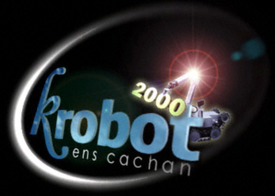
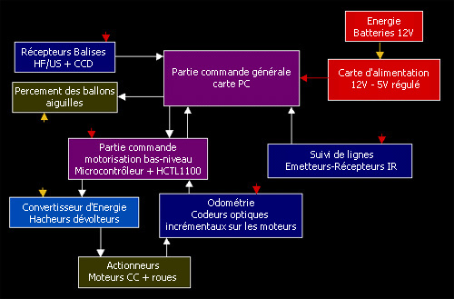
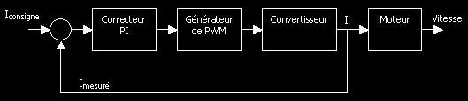
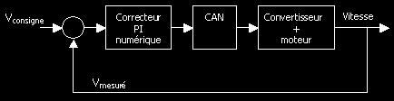

# La coupe de France de robotique 2000

## Robot principal

La conception de PMI (Parties Mobiles ou Immobiles : petits robots annexes)
passionne une bonne partie de l'équipe. Mais leur fabrication est difficile
le résultat n'est pas toujours à la hauteur des espérances.

L'an dernier, beaucoup de ces PMI ont malheureusement contribué à remplir le
fossé placé au milieu du terrain, la nôtre notamment. C'est pourquoi cette
année, suivant l'exemple de nos voisins de l'IUT de Cachan, loin de délaisser
la réalisation de PMI, nous donnons la priorité à la réalisation d'un robot
principal simple, fiable et précis. Toutes les solutions originales susceptibles
d'entraver son bon fonctionnement sont donc renvoyées sur les PMI ou tout
simplement éliminées.

### Diagramme fonctionnel

L'architecture de ce robot principal est la suivante. 

### Énergie

**Cahier des charges** :

  * Fournir l'énergie nécessaire (environ 50 W) au robot, pendant 1 mn 30,
    de manière fiable.
  * Découplage de la partie puissance et de l'électronique de commande.

**Possibilités** :

|                 | Accumulateurs Ni-Cd       | Batteries au plomb            |
|-----------------|---------------------------|-------------------------------|
| Taille          | peu encombrants et légers | encombrantes et lourdes       |
| Fiabilité       | hasardeuse                | bonne                         |
| Tension de base | 1,8 V et multiples        | 6 V et multiples              |
| Recharge        | complexe                  | simple                        |
| Débit           | quasi-illimité            | limité au-delà de nos besoins |

**Choix retenu** : 2 Batteries au plomb Eleckson BEL 120 013 12 V 1,3 Ah.

**Raison** : fiabilité et simplicité de la charge

**Avancement** : offertes l'an dernier par Eleckson.

Si le budget est suffisant, un passage aux accumulateurs NiCd est en discussion,
ceci en raison du gain de poids et de place, indispensable dans les PMI,
important dans le robot principal.

### Carte d'alimentation

**Cahier des charges** :

  * Témoin de décharge des batteries
  * 12 V : limitation de courant par fusible, 16 A max
  * 5 V régulé : régulateurs 7805 + limitation de courant, 4 A max
  * Possibilité de connecter une source externe pour faciliter le déroulement
    des essais

**Avancement** : en cours de conception

### Partie Commande Générale

**Cahier des charges** :

  * Gestion des signaux en provenance des balises et des capteurs de suivi de ligne
  * Positionnement sur le terrain
  * Recherche de la position des ballons mobiles et du robot adverse
  * Elaboration de la trajectoire optimale
  * Rapidité de calculs (travail en temps réel)

**Possibilités** :

|                     | Micro-contrôleurs | Carte PC104 | Carte PC    |
|---------------------|-------------------|-------------|-------------|
| Taille              | compact           | compacte    | encombrante |
| Fiabilité           | fiable, robuste   | robuste     | fragile     |
| Prix                | peu cher          | très chère  | chère       |
| Echanges E/S        | rapides, simples  | complexes   | complexes   |
| Puissance de calcul | limitée           | suffisante  | suffisante  |

**Choix retenu** : Carte PC Erim lightboard 486v2vf8 486 DX4 100 Vidéo intégrée
8 Mo de RAM 8 Mo de flash bootable ports série, clavier, souris, disquette et
disque dur.

**Raison** : Cette année, nous voulions une puissance de calcul suffisante pour
traiter de signaux divers en temps réel et faire les opérations nécessaires à
leur interprétation. La carte PC104 étant hors de prix, nous avons porté notre
choix sur cette carte PC industrielle de chez Erim, robuste
(choc max. supporté : 30 G) et complète.

**Avancement** : Nous avons acheté la carte, et sommes en train de concevoir
les cartes d'interface, grâce à Protel, qui nous accordé une licence
multi-postes de son logiciel de conception électronique Protel99.
Nous avons également bénéficié du soutien généreux de Lynx Real-Time Systems,
Inc. qui nous a offert son système d'exploitation temps-réel LynxOS, les outils
de développement et toute la documentation nécessaires à la programmation du
robot.

### Système de percement des ballons

**Cahier des charges** :

  * Crever les ballons de manière infaillible
  * Ne pas être dépendant de la position du ballon par rapport au robot

**Possibilités** :

|              | Aiguilles                     | Point chaud                      |
|--------------|-------------------------------|----------------------------------|
| Efficacité   | moyenne                       | excellente                       |
| Réglement    | cadre de sécurité bien défini | pas de précision sur la sécurité |
| Consommation | nulle                         | importante                       |

**Choix retenu** : Des recherches dans les deux voies.

**Avancement** : Un premier système à base d'aiguilles à fait ses preuves,
il reste à l'adapter au robot principal. La conception d'un point chaud à
base de fil résistif est en cours.

### Balises

**Cahier des charges** :

  * Permettre de connaître sa position absolue sur le terrain
  * Connaître la position relative ou absolue des ballons adverses
  * Connaître la position relative ou absolue du robot adverse
  * Ne pas être sensible aux brouillages

Compte tenu de la diversité des tâches à réaliser, l'équipe du krobot s'est
orientée vers La réalisation de deux sous-systèmes indépendants et spécifiques.
L'un, destiné à la localisation du robot sur le terrain, à base de signaux
ultra-son et HF; l'autre, au repérage des ballons mobiles, par le traitement
des images fournies par une caméra CCD.

### Localisation du robot

**Possibilités** :

|                          | HF      | Infrarouge | Ultrasons |
|--------------------------|---------|------------|-----------|
| Rapidité                 | bonne   | bonne      | moyenne   |
| Sensibilté au brouillage | moyenne | élevée     | élevée    |
| Précision                | moyenne | moyenne    | bonne     |

**Choix retenu** :
Un système combinant HF et ultra-sons a déjà été développé l'année dernière,
mais n'a pas pu être utilisé, faute de tests suffisant. Nous allons donc
reprendre ce système.

**Avancement** :
les travaux sont déjà bien avancés. Quelques modifications mineures sont à
apporter au système, et il reste à réaliser toute la phase de tests.

### Repérage des ballons mobiles

**Avancement** : Un système de reconnaissance de formes/couleurs est
actuellement à l'étude, pour exploiter les images issues d'une caméra CCD,
ou d'une WebCam.

### Suivi de lignes

**Cahier des charges** :

  * Permettre la détection des lignes blanches sous le robot afin de confirmer
    ou rectifier les déplacements rapides gérés principalement à l'aide de
    l'odométrie
  * Ne pas être sensible aux variations de luminosité et aux rayonnements
    infrarouges rasants dus à l'éclairage intense des terrains à la coupe.
  * Ne pas être sensibles aux variations du relief
  * Sortie logique 0/+5 V

**Possibilités** :

|                           | Barrette ou caméra CCD | Infrarouge          |
|---------------------------|------------------------|---------------------|
| Sensibilité au relief     | non                    | oui                 |
| Sensibilité à l'éclairage | moyenne                | importante          |
| Traitement du signal      | complexe               | relativement simple |
| Coût                      | élevé                  | faible              |

**Choix retenu** : émetteurs-récepteurs infrarouges bas de gamme

**Raison** : Nous possédions les capteurs IR et nous avons déjà expérimenté l'utilisation du suivi de lignes les deux années précédentes. En fonction des résultats de cette solution sur terrain accidenté et du budget, nous envisagerons ou non l'autre solution ou l'achat de capteurs de meilleure qualité.

**Avancement** : Les premiers montages font suite aux essais destinés à se familiariser avec ces capteurs parfois récalcitrants.

### Actionneurs

**Cahier des charges** :

  * Permettre un déplacement rapide et précis du robot sur tout le terrain.
  * Supporter une charge d'environ 10 kg.
  * Vitesse 1 m/s

**Possibilités** :

|                | 6 roues pathfinder | 4 roues motrices | 2 roues motrices + roues folles | Chenilles | Pattes     |
|----------------|--------------------|------------------|---------------------------------|-----------|------------|
| Complexité     | très grande        | grande           | faible                          | faible    | énorme     |
| Asservissement | ?                  | moyen            | facile                          | difficile | impossible |
| Patinage       | ?                  | non              | non                             | oui       | non        |
| Expérience     | non                | non              | oui                             | non       | non        |

**Choix retenu** : 2 roues motrices + 1 roue folle (schéma et photos), roues
110 mm avec bande de roulement 75 shore, motoréducteurs mdp-maxon RE 025G/PLG 32

**Raison** : La forme du terrain rendait les solutions originales tentantes,
surtout celle d'un robot hexapode. Mais notre expérience de l'an dernier, la
possession des motoréducteurs mdp-maxon et de leurs codeurs, la nécessité de
réaliser un asservissement en position précis ainsi que le maître mot du
projet : "simplicité = fiabilité" nous a fait choisir la solution classique
mais simple à mettre en œuvre au niveau mécanique de deux roues motrices et
d'une ou deux roues folles. La direction du robot est le résultat de la
différence de vitesse entre les deux roues motrices.

**Avancement** : Les moteurs datent de l'an dernier. Nous avons dimensionné
les roues en fonction de la forme du terrain, de l'espace disponible et de la
vitesse recherchée, les deux roues sont usinées, la roue folle achetée et un
châssis provisoire nous a permis de faire des essais encourageants.

### Convertisseur d'énergie

**Cahier des charges** :

  * Transformer le signal envoyé par la partie commande en une tension variable,
    positive ou négative, de forte puissance d'alimentation des moteurs.
  * Protéger les moteurs.
  * Délivrer au démarrage toute la puissance nécessaire (8 A).
  * Asservir les moteurs en courant

**Choix retenu** : Classiquement nous commandons les moteurs avec une PWM
(modulation de largeur d'impulsions) de rapport cyclique variable, centrée
sur 0,5. La PWM de commande de chaque moteur est l'entrée d'un hacheur
dévolteur. Pour la boucle d'asservissement en courant, nous avons préféré un
capteur de courant à effet Hall LEM LTS 15-NP (Radiospares) à une mesure de
tension sur une résistance. Il est plus précis mais plus cher.

**Avancement** : Dans l'attente de nouvelles cartes moteurs, actuellement en
conception, nous avons réparé des cartes datant de la coupe 98. Elles sont
composées de ponts en H L6203 et de limiteur de courant L6506, le tout provenant
de chez SGS Thomson, disponible partout. L'asservissement en courant est en
cours de conception.

**Schéma-bloc de la boucle d'asservissement en courant** :

### Odométrie

**Cahier des charges** :

  * Permettre de connaître instantanément la position relative du robot.
  * Permettre un asservissement rapide et précis en position et en vitesse du
    robot.

**Possibilités** :

|                      | Roue motrice codeuse | Roue non motrice codeuse |
|----------------------|----------------------|--------------------------|
| Précision            | très élevée          | moyenne                  |
| Risque de glissement | important            | faible                   |
| Coût                 | moyen                | faible                   |

**Choix retenu** : Roues motrices codeuses. Codeurs HE 5540 (500 points par tour)

**Raison** : La fixation des codeurs optiques sur l'axe du moteur permet de
multiplier le nombre de points par tour par le rapport de réduction à la sortie
du moteur. Nous obtenons alors 10125 points par tour, ce qui peut paraître
surdimensionné. Si c'est le cas effectivement pour l'asservissement en position,
en ce qui concerne l'asservissement en vitesse, il n'en est rien. En effet,
plus mauvaise est la résolution des codeurs, plus important sera le retard
induit. Or un retard dans une boucle d'asservissement diminue la stabilité.

**Avancement** : Les codeurs datent de l'an dernier

### Partie commande motorisation bas niveau

**Cahier des charges** :

  * Permettre un déplacement suffisamment précis pour être capable de faire le
    tour du terrain et se repositionner sur la base de départ avec une erreur de
    moins de 5 cm.
  * Rapidité afin d'autoriser une vitesse de 1 m/s.
  * Limiter la sensibilité aux perturbations de la trajectoire.

**Choix retenu** : Comme pour les moteurs et les codeurs, nous avons repris le
système de l'an passé, deux HCTL 1100. Le HCTL 1100 est un contrôleur spécifique
8 bits qui, dans la boucle d'asservissement en vitesse remplit les fonctions de
comparateur avec en entrée les signaux issus des codeurs et de correcteur
numérique proportionnel intégral (PI). Ce correcteur permet de limiter
l'influence des perturbations, la présence de l'intégrateur garantissant la
précision. Il permet aussi de faire un asservissement en position. Il est
produit par Hewlet Packard. On retrouve son équivalent chez Siemens et SGS
Thomson : le L629 qui lui travaille sur 16 bits et réalise un correcteur
proportionnel intégral dérivé (PID) mais qui est plus complexe à mettre en
œuvre et deux fois plus cher.

**Schéma-bloc de la boucle d'asservissement en vitesse** :

**Avancement** : L'an dernier, par manque de temps, l'asservissement en mode
proportionnel intégral était instable. Le système était contrôlé uniquement par
des CPLD. Cette année, nous apportons un grand soin à la modélisation du
système afin de bien choisir les coefficients du filtre correcteur.
Actuellement, après une prise de contact avec les HCTL, un long travail
de détermination des paramètres du système a commencé.

