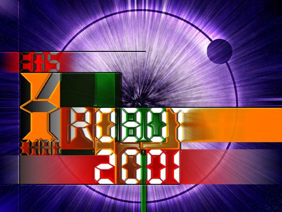

# La coupe de France de robotique 2001

## Résultats

Au total, avec 17 points, nous avons terminé en 94ème position
(non qualifiés pour les huitièmes de finale) sur les 133 équipes homologuées.

| Match | Equipes                  | Drapeaux déposés | Résultats            | Points     | Classement     |
|-------|--------------------------|------------------|----------------------|------------|----------------|
| 1er   | Krobot  INSA Toulouse | 1  0          | Défaite  Défaite  | 0  0    | ?  30       |
| 2ème  | Krobot  ENSI-Caen     | 0  0          | Défaite  Forfait  | 0  0    | ?  ?        |
| 3ème  | Krobot  ENSEIRB       | 0  1          | Défaite  Victoire | 0  10   | ?  ?        |
| 4ème  | Krobot  Club Eureka   | 1  1          | Égalité  Égalité  | 7  7    |  ?  ?       |
| 5ème  | Krobot  ENI Metz      | 1  0          | Victoire  Défaite | 10  0   | 94  ?       |

Homologation réussie Jeudi Vers 12H

