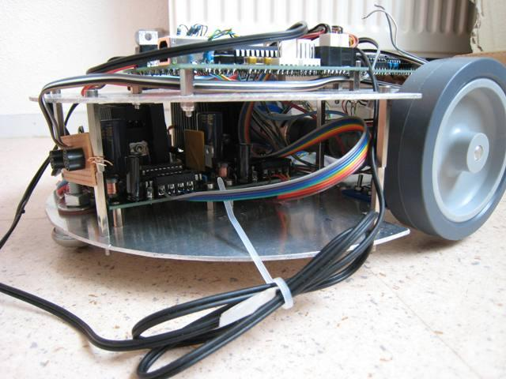
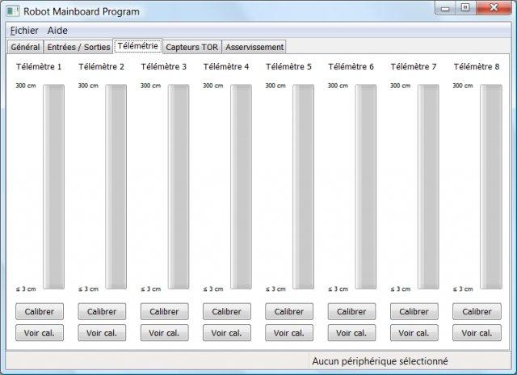
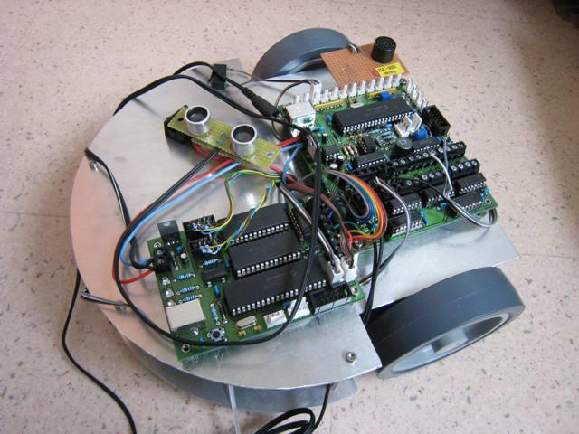

# La coupe de France de robotique 2009

[Lien vers le rapport de CVI expliquant le projet](doc/2009_cvi.pdf)

## Robot à 2 roues

Ce projet a pour but de concevoir un robot à roues complet,
capable d'accomplir des tâches simples, de manipuler des objets et
disposant de capacités d'interaction humaine.
Il comprend la conception de cartes électroniques,
la programmation de microprogrammes et d'intelligence artificielle,
le logiciel d'interaction ordinateur-robot et la mécanique.

Vue des deux ponts en H du prototype.

Interface utilisateur pour intéragir avec le robot.

Prototype pour la première implémentation du chassis.

## Sources du projet

[Le pont en H utilisant un HIP4081](https://github.com/ens-krobot/elec_boards/tree/master/H_Bridge_HIP4081)

[Le controlleur des moteurs avec un LM629](https://github.com/ens-krobot/elec_boards/tree/master/Controller_Motor_LM629)

[Le capteur de proximité](https://github.com/ens-krobot/elec_boards/tree/master/Sensor_Proximity)

[La carte de développement USB](https://github.com/ens-krobot/elec_boards/tree/master/USB_Dev_Board)
