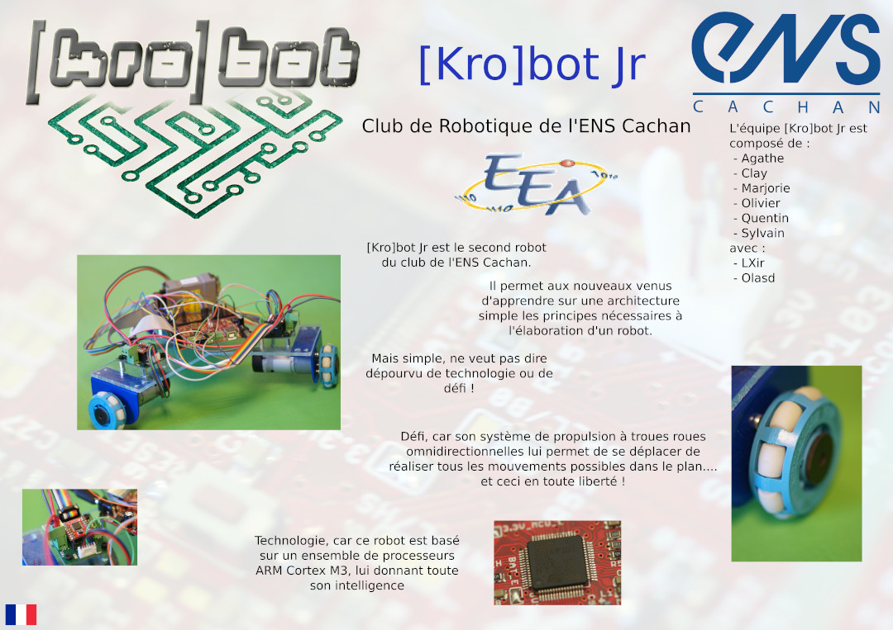

# La coupe de France de robotique 2010

Les projets Git associés :

  * [Méca, Modèles du robot Senior](https://github.com/ens-krobot/meca_2010_Senior)
  * [Méca, Modèles du robot Junior](https://github.com/ens-krobot/meca_2010_Junior)
  * [Méca, Modèles de la Table](https://github.com/ens-krobot/meca_2010_Table)
  * [Méca, Pièces communes](https://github.com/ens-krobot/meca_2010_Common)
  * [Info, Logiciel de contrôle](https://github.com/ens-krobot/info_2010_control2010)
  * [Info, Interface utilisateur](https://github.com/ens-krobot/info_2010_User_Interface)
  * [Info, Communication série](https://github.com/ens-krobot/info_2010_ocaml-serial)
  * [Info, Couche de communication série](https://github.com/ens-krobot/info_2010_USB_Com_Layer)

## Posters de nos deux équipes

