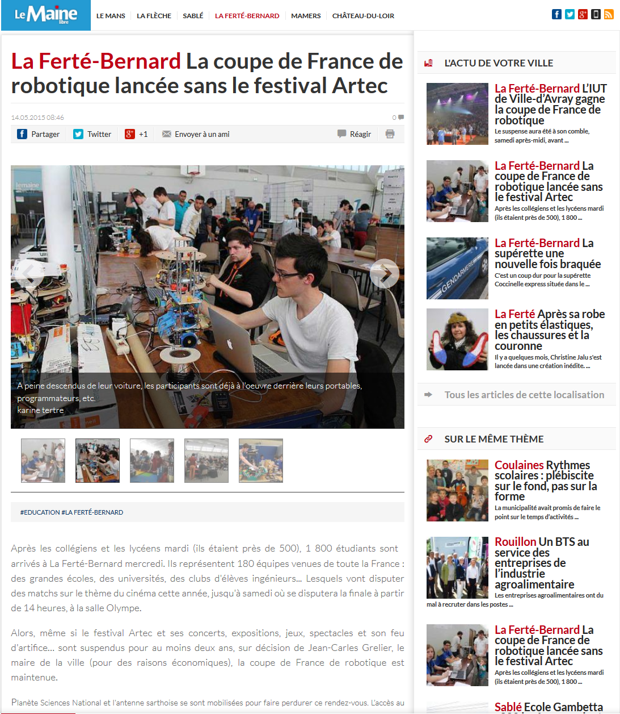
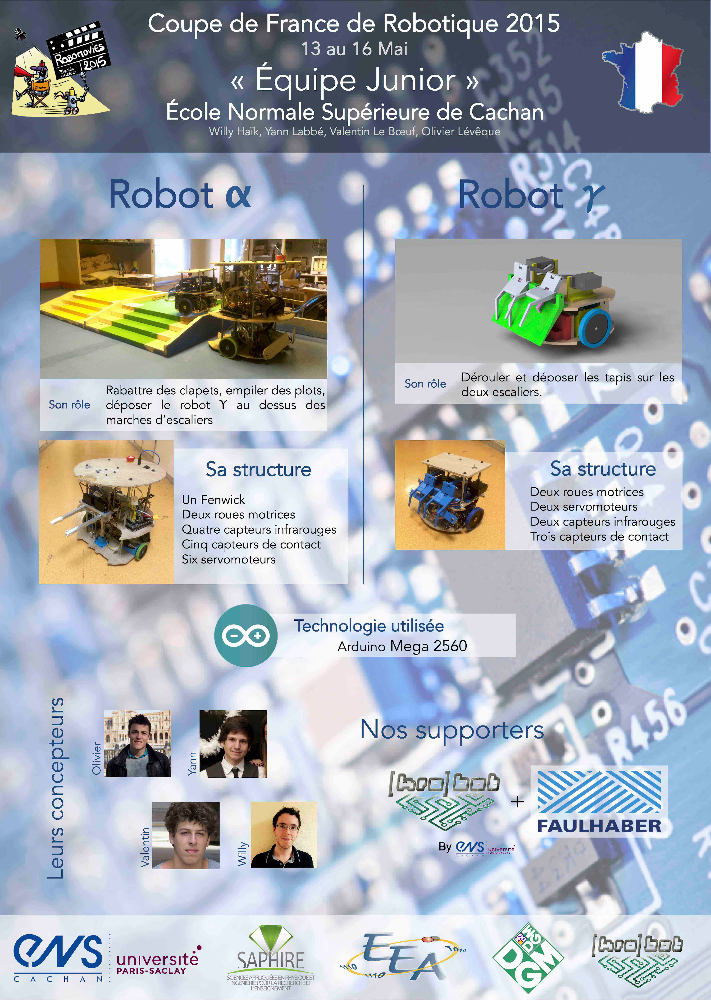
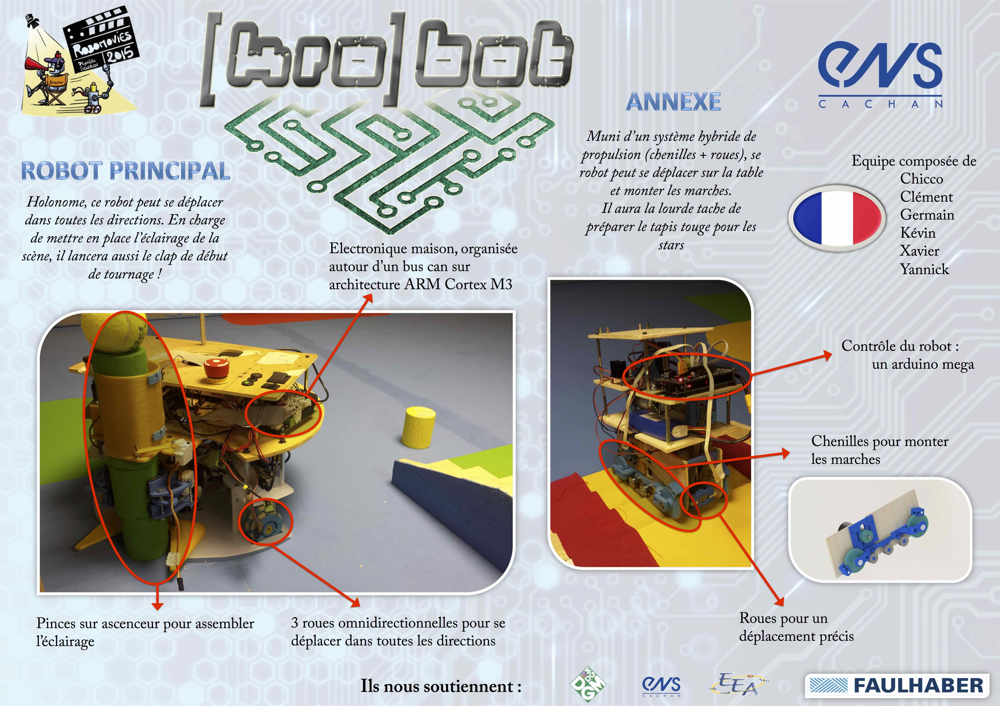

# La coupe de France de robotique 2015

## Comme chaque année, Le club participe à la Coupe de France de Robotique.

Cette 22ième édition de la Coupe, organisé le 13 au 16 mai 2015 à La Ferté-Bernard par Planète Sciences, sera, comme les précédentes, le plus grand évènement de robotique amateur d’Europe !

Lors de cette rencontre, près de 200 équipes (soit plus de 1 500 participants) s’affronteront sur un thème original : Robomovies. Il s’agit d’un défi scientifique et technique qui pousseront les candidats à mettre en valeur leurs connaissances et leur savoir-faire en matière de robotique et d’innovation. Ce sera une compétition de très haut niveau rassemblant la quasi-totalité des écoles d’ingénieurs et d’instituts universitaires de technologie (IUT) français.

L’objectif de la compétition est de faire évoluer des robots totalement autonomes sur une zone de jeux durant 90 secondes.

Sous le thème 2015 de Robomovies, les robots devront réaliser les tâches suivantes :

  * marquer le début des scènes de tournages en fermant des claps,
  * éclairer le plateau de tournage en assemblant les spots,
  * ramasser et apporter du pop-corn aux spectateurs,
  * aller à la cérémonie des récompenses en montant les marches,
  * accueillir les stars, en déroulant le tapis rouge.

## Notre stand dans le journal local

Voir l'article complet ici : <https://www.lemainelibre.fr/actualite/la-ferte-bernard-la-coupe-de-france-de-robotique-sans-le-festival-artec-13-05-2015-133443>.

## La zone de jeux

<iframe width="560" height="315" src="https://www.youtube-nocookie.com/embed/TmtLTKzrGKw" frameborder="0" allow="accelerometer; autoplay; encrypted-media; gyroscope; picture-in-picture" allowfullscreen></iframe>

## Posters de nos deux équipes

