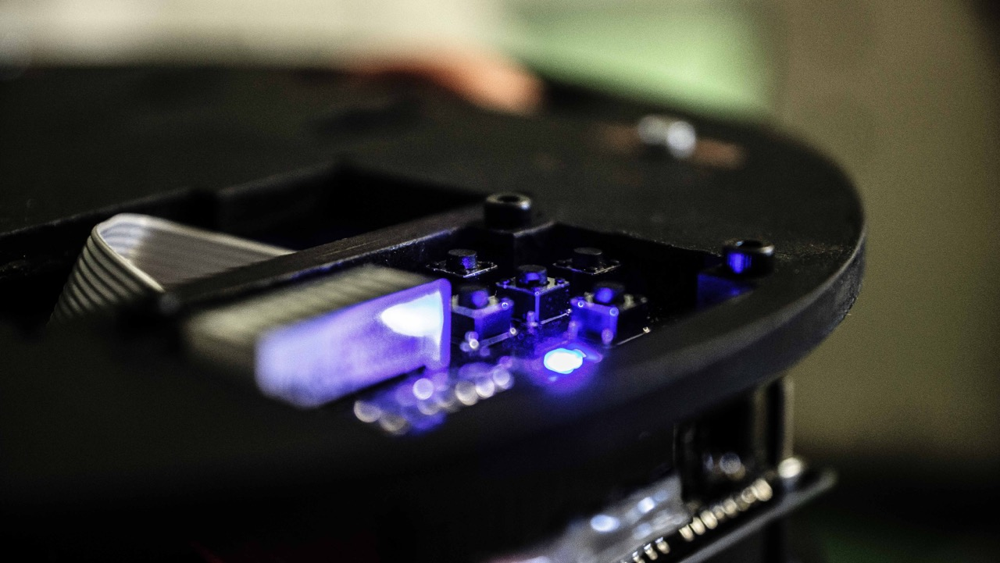
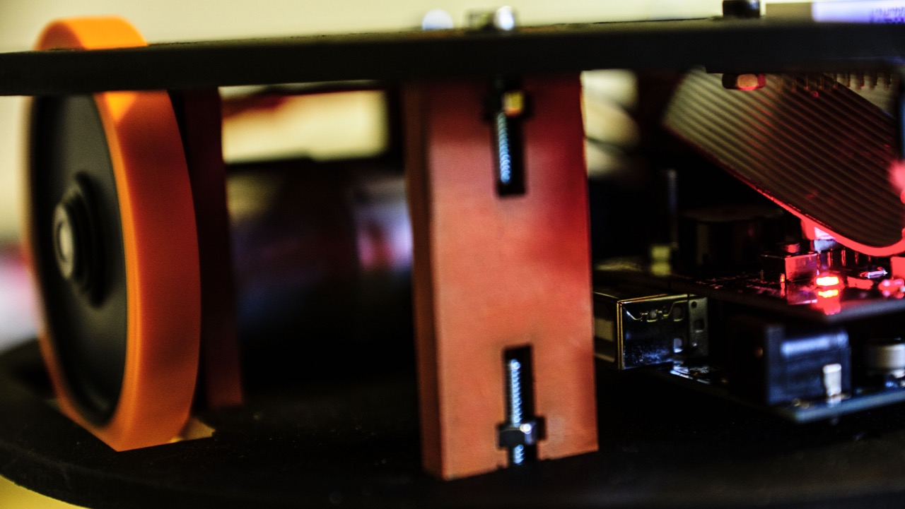
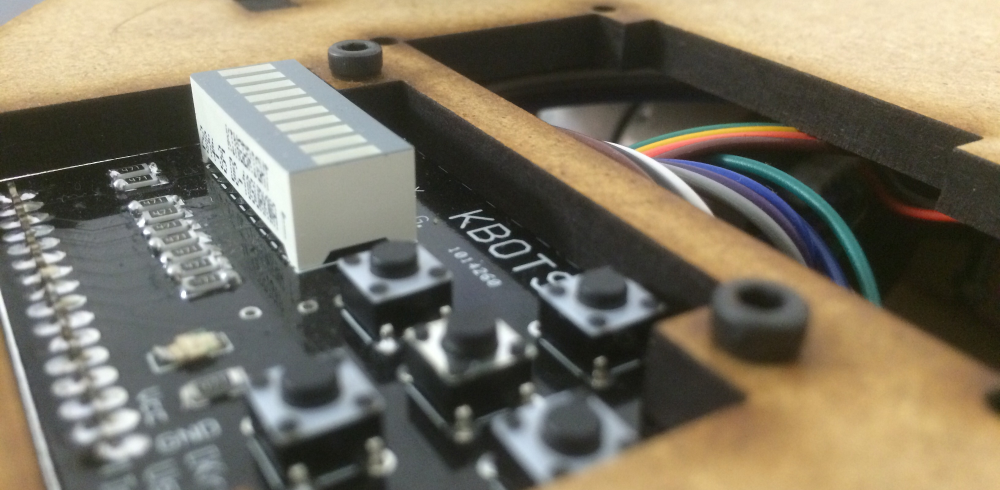
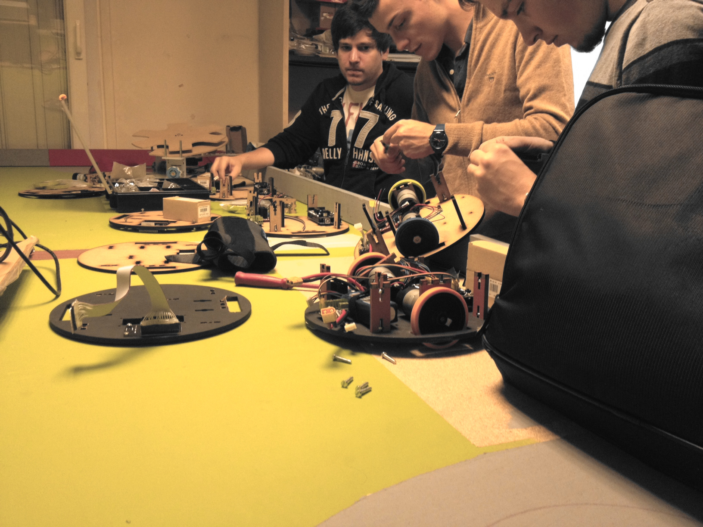

# Le KBOT

Rien de mieux qu'un KBOTS, ce petit robot à deux roues, pour apprendre les bases de la robotique !

## Introduction

Ces petites créatures sont entièrement réalisées par les premières années pour
comprendre, dans les moindres détails, les fondamentaux de la robotique & de
la programmation sous Arduino.

Découpe laser, impression 3D, soudures de shields maisons, & développement
d'un programme d'asservissement sur Arduino Mega sont les clefs pour se
préparer au mieux au plus grand défi intellectuel & ludique de France :
La coupe de Robotique.

Ce robot a été développé par [Olivier Lévêque](https://github.com/oleveque/)
en 2017.
Vous trouverez tout le code source et les ressources utiles sur le dépôt GitHub
associé : <https://github.com/ens-krobot/kbot_2017>.

Ce projet a finalement aidé à la création de
[Mr. Robotics](https://github.com/WhoIsMrRobotics).

## Faire son KBOT

Le [Kro]bot vend des kits de démarrage de KBOT à ses membres et les aide lors
de la réalisation.
Si vous êtes intéressé, venez discuter un mercredi soir !

